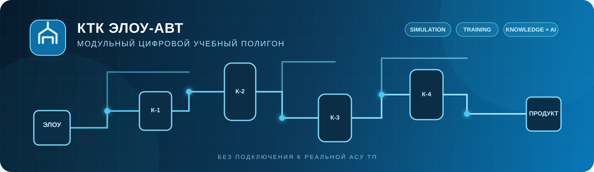
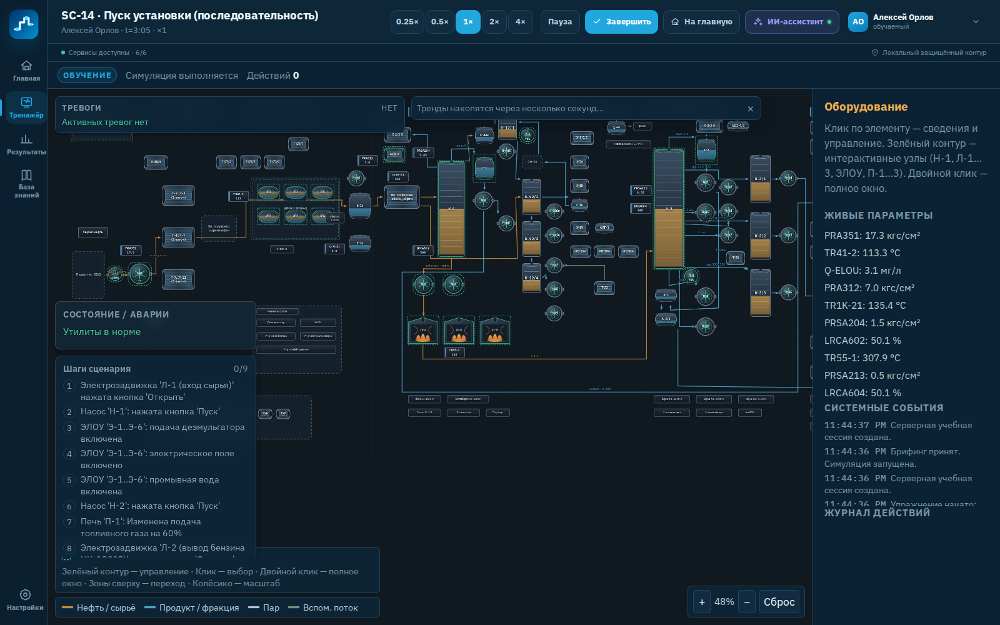
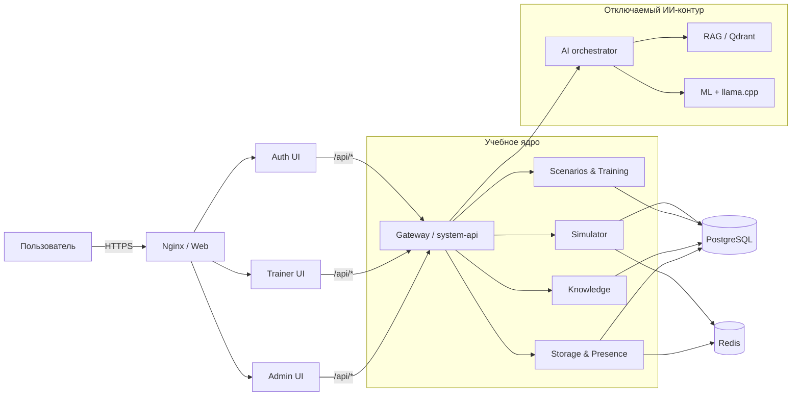

<div align="center">



# КТК ЭЛОУ-АВТ

**Модульный компьютерный тренажёрный комплекс для безопасного изучения эксплуатации ЭЛОУ-АВТ**

Динамическая модель процесса · интерактивная мнемосхема · сценарии и мини-тренировки<br />
ролевая работа · база знаний · отчётность · отключаемый локальный ИИ-помощник


[Возможности](#-возможности) · [Быстрый запуск](#-быстрый-запуск) · [Архитектура](#-архитектура) · [Документация](#-документация) · [Разработка](CONTRIBUTING.md)

</div>

> [!IMPORTANT]
> **Это учебный прототип, а не производственная АСУ ТП.** Комплекс не подключается к реальному оборудованию, не управляет установкой и не заменяет технологический регламент, ПЛА/ПМЛА, производственные инструкции или решения ответственного персонала.

## 🎯 О проекте

КТК ЭЛОУ-АВТ воспроизводит поведение учебной модели установки и позволяет отрабатывать действия в штатных и нештатных режимах без воздействия на реальный технологический процесс. Обучаемый управляет параметрами и оборудованием через мнемосхему, система фиксирует каждое действие, рассчитывает результат по детерминированным правилам и формирует персональные рекомендации.

Проект построен модульно: три frontend-приложения, серверный движок симуляции, сервисы сценариев, обучения, знаний, хранения и отдельный ИИ-контур. Весь демонстрационный стек можно запустить локально через Docker Compose.

<table>
  <tr>
    <td align="center"><strong>18</strong><br />учебных упражнений</td>
    <td align="center"><strong>13</strong><br />мини-тренировок</td>
    <td align="center"><strong>57</strong><br />статей базы знаний</td>
    <td align="center"><strong>3</strong><br />роли в прототипе</td>
  </tr>
</table>

## ✨ Возможности

| Контур | Что реализовано |
| --- | --- |
| 🏭 **Симуляция** | Динамическая схема ЭЛОУ-АВТ, изменяемые параметры, управление оборудованием, блокировки, отказы и развитие процесса во времени |
| 🎓 **Обучение** | Пуск, останов, отклонения и аварийные ситуации; сегментные мини-тренировки с условиями завершения и точечными рекомендациями |
| 👥 **Роли** | Обучаемый, инструктор и администратор; учебные группы, назначение сценариев и разграничение доступа |
| 📊 **Контроль** | Полная история действий, системные события, детерминированная оценка, отчёты и кабинет инструктора |
| 📚 **Знания** | 57 подробных статей в восьми разделах, полнотекстовый поиск и локальный фонд учебных материалов |
| 🤖 **ИИ-помощник** | Разбор траектории действий, RAG-поиск, рекомендации и чат с локальной LLM или шаблонным fallback |
| 🎨 **Интерфейс** | Светлая, тёмная и системная темы, масштаб, шрифт, плотность интерфейса и параметры доступности |
| 🔒 **Изоляция** | Локальный Docker-контур без отправки учебных запросов во внешние AI API и без подключения к АСУ ТП |

## 🖥️ Интерфейс тренажёра

Мнемосхема представляет технологическую цепочку, связи оборудования и инженерные коммуникации в едином рабочем поле. Масштабируемые зоны позволяют переходить от общего состояния установки к конкретному сегменту тренировки.

<a href="docs/assets/screenshots/trainer-workspace.png">
  
</a>

<div align="center"><sub>Фактический экран текущего React-прототипа: управление сессией, тревоги, сценарный чек-лист, мнемосхема, параметры и журнал действий. Нажмите, чтобы открыть в полном размере.</sub></div>

## 🧩 Архитектура



Клиент обращается к backend только через `/api/*`. Авторитетное состояние симуляции принадлежит серверному движку: UI отправляет команды и отображает серверную проекцию. ИИ-модуль имеет только рекомендательную роль — он не изменяет процесс и не принимает решение о зачёте.

Подробнее: [архитектура](docs/ARCHITECTURE.md) · [API](docs/API.md) · [ИИ-контур](docs/AI_ARCHITECTURE.md) · [целевое промышленное состояние](docs/INDUSTRIALIZATION.md)

## 🚀 Быстрый запуск

### Что понадобится

- Git;
- Docker Engine с Docker Compose v2 или Docker Desktop;
- от 8 ГБ RAM; 12–16 ГБ рекомендуется для локальной LLM;
- около 6 ГБ свободного места под образы, данные и модель.

> [!TIP]
> Node.js и Python на компьютере не требуются, если проект запускается целиком через Docker.

### 1. Получите проект и создайте локальную конфигурацию

```bash
git clone https://github.com/itacher173-arch/myBestKtKProject.git
cd myBestKtKProject
cp .env.example .env
```

PowerShell:

```powershell
Copy-Item .env.example .env
```

Замените демонстрационные значения в `.env`:

```dotenv
POSTGRES_PASSWORD=<случайный_пароль>
KTK_ADMIN_LOGIN=<логин_администратора>
KTK_ADMIN_PASSWORD=<случайный_пароль>
KTK_AUDIT_HMAC_SECRET=<случайный_секрет>
```

> [!CAUTION]
> Никогда не коммитьте `.env`, пароли, токены, ключи и реальные производственные данные. Для корпоративных сред используйте штатное хранилище секретов.

### 2. Запустите все сервисы

```bash
docker compose up --build -d
docker compose ps
```

Первый запуск загружает GGUF-модель размером около 1 ГБ, проверяет SHA-256 и сохраняет её в именованном Docker volume.

### 3. Откройте приложение

| Компонент | Адрес | Назначение |
| --- | --- | --- |
| Авторизация | <http://localhost:8080/> | единая точка входа |
| Тренажёр | <http://localhost:8080/app/> | симуляция, обучение и база знаний |
| Администрирование | <http://localhost:8080/admin/> | пользователи, роли и группы |
| Gateway health | <http://localhost:8000/api/health> | техническая проверка backend |

Администратор создаётся при первом старте из переменных `KTK_ADMIN_*`. Саморегистрация отключена.

### 4. Остановите комплекс

```bash
docker compose down
```

Команда сохраняет именованные volumes. Не добавляйте `--volumes`, если данные нужно оставить.

Windows 10, параметры запуска и диагностика подробно описаны в [инструкции по развёртыванию](docs/DEPLOYMENT.md) и [разделе решения проблем](docs/TROUBLESHOOTING.md).

## 📦 Состав репозитория

```text
myBestKtKProject/
├── frontend/
│   ├── auth/              # портал авторизации
│   ├── trainer/           # тренажёр и учебные модули
│   └── admin/             # административная панель
├── backend/
│   ├── simulator/         # процессная модель, ПАЗ и отказы
│   ├── knowledge/         # статьи и поисковый индекс
│   ├── training/          # мини-тренировки
│   ├── ai, ml, rag/       # локальный рекомендательный контур
│   └── auth, storage/     # доступ, отчёты и аудит
├── deploy/docker/         # сборка frontend и Nginx
├── docs/                  # архитектура и руководства
├── scripts/               # проверки репозитория
└── docker-compose.yml     # локальная композиция сервисов
```

Подробности по каждому модулю находятся в его собственном `README.md`: [frontend](frontend/README.md), [backend](backend/README.md), [deploy](deploy/README.md), [knowledge](backend/knowledge/README.md), [simulator](backend/simulator/README.md), [AI](backend/ai/README.md).

## 🧪 Проверка изменений

<details>
<summary><strong>Команды локальной проверки</strong></summary>

```bash
# Backend
python -m pip install -r backend/requirements.txt pytest ruff
ruff check backend --config backend/ruff.toml
python -m compileall backend
pytest -q backend/tests

# Frontend: установка выполняется отдельно из-за независимых lock-файлов
npm ci --prefix frontend/trainer
npm ci --prefix frontend/auth
npm ci --prefix frontend/admin
npm run build
npm run verify:domain

# Документация
npm run check:docs
```

</details>

Полная матрица локальных проверок и критерии приёмки приведены в [руководстве по тестированию](docs/TESTING.md).

## 🛡️ Статус и границы решения

| Сейчас: демонстрационный прототип | Цель: корпоративная платформа |
| --- | --- |
| Локальный Docker Compose | Kubernetes с отдельными TEST, PREPROD и PROD |
| Одиночные PostgreSQL, Redis и Qdrant | HA, резервирование, PITR и проверяемое восстановление |
| Встроенная авторизация прототипа | Корпоративный AD/Keycloak, OAuth 2.0/OIDC и ролевая модель |
| Синхронное взаимодействие сервисов | Надёжная очередь сообщений и событийная шина |
| Локальные журналы | Централизованные логи, мониторинг, аудит и SIEM |
| Локальная LLM или fallback | Изолированный управляемый AI-runtime с контролем моделей |

План перехода, требования PREPROD, эксплуатационные контроли и обязательная проверка отката описаны в [дорожной карте индустриализации](docs/INDUSTRIALIZATION.md).

## 📖 Документация

| Для кого | Основные материалы |
| --- | --- |
| Пользователь и демонстратор | [Запуск](docs/DEPLOYMENT.md) · [Решение проблем](docs/TROUBLESHOOTING.md) · [База знаний](backend/knowledge/README.md) |
| Разработчик | [Development Guide](docs/DEVELOPMENT.md) · [API](docs/API.md) · [Тестирование](docs/TESTING.md) |
| Архитектор | [Архитектура](docs/ARCHITECTURE.md) · [ADR](docs/adr/README.md) · [Индустриализация](docs/INDUSTRIALIZATION.md) |
| Эксплуатация | [Runbook](docs/OPERATIONS.md) · [Безопасность](SECURITY.md) · [Поддержка](SUPPORT.md) |
| Участник проекта | [CONTRIBUTING](CONTRIBUTING.md) · [Code of Conduct](CODE_OF_CONDUCT.md) · [Changelog](CHANGELOG.md) |

Полный навигатор находится в [`docs/README.md`](docs/README.md).

## 🤝 Участие в разработке

Изменения в `main` должны проходить через короткоживущую ветку, pull request, локальные проверки и review. Изменения учебного контента и правил безопасности требуют предметной проверки технологом и специалистом по промышленной безопасности.

Перед началом работы прочитайте [CONTRIBUTING.md](CONTRIBUTING.md). Уязвимости не публикуются в открытых issues — используйте порядок из [SECURITY.md](SECURITY.md).

## ⚖️ Правовой статус

Исходный код и материалы проекта не получают открытую лицензию автоматически. Условия использования приведены в [LICENSE.md](LICENSE.md), сведения о сторонних компонентах — в [THIRD_PARTY_NOTICES.md](THIRD_PARTY_NOTICES.md).
