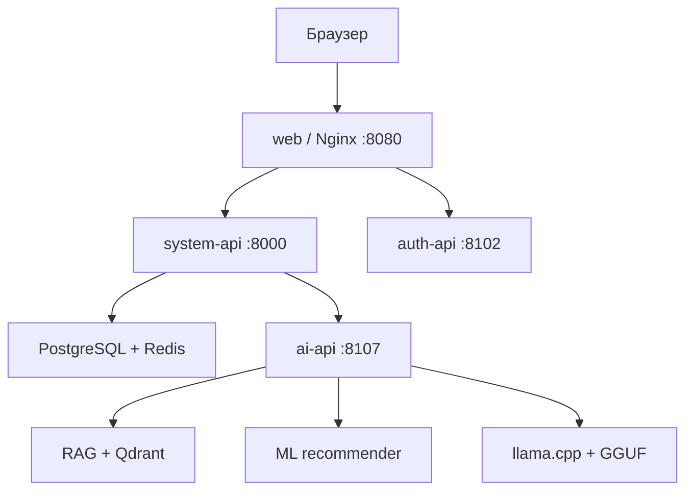
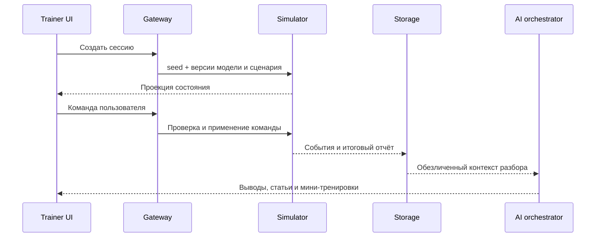

# Архитектура

## Назначение и границы

КТК моделирует учебное поведение ЭЛОУ-АВТ и действия персонала без подключения к реальной АСУ ТП. Авторитетное состояние процесса, последовательность событий и детерминированная оценка находятся на backend. Интерфейс отображает серверную проекцию и отправляет команды, но не является источником технологического состояния.

ИИ-контур является вспомогательным. Он объясняет результат и предлагает материалы, однако не формирует обязательные правила зачёта, не изменяет ПАЗ и не отправляет команды симулятору.

## Контейнерная схема прототипа

`system-api` сейчас является единицей развёртывания, внутри которой совместно запускаются gateway, training, knowledge, storage, presence и FastAPI-движок симуляций. Каталоги остаются модульными, но ещё не являются независимо масштабируемыми production-микросервисами.

## Компоненты

| Компонент | Ответственность | Основные данные |
| --- | --- | --- |
| `web` | статические frontend-сборки, TLS-терминация в целевом контуре, reverse proxy | отсутствуют |
| `auth-api` | пользователи, роли, вход, rate limit, 12-часовые серверные сессии | PostgreSQL, Redis |
| `system-api` | gateway, симуляция, сценарии, обучение, знания, отчёты, аудит, presence | PostgreSQL, Redis, JSON-каталоги |
| `ai-api` | единый контракт анализа, чата и risk preview | не владеет оценкой или симуляцией |
| `ml-recommender` | классификация ошибок, профиль навыков, ranking обучения | локальные модели и граф навыков |
| `rag-api` | нарезка и поиск версионированных статей | Qdrant и каталог знаний |
| `llm-server` | генерация объяснений по переданному контексту | локальный GGUF |
| `postgres` | пользователи, группы, отчёты, аудит | постоянные данные |
| `redis` | сессии, presence и оперативное состояние | краткоживущие данные |

## Поток учебной сессии

Каждая симуляция фиксирует `seed`, `modelVersion` и `scenarioVersion`. Это обеспечивает повторяемость учебного разбора при одинаковой версии кода и данных.

## Владение данными

| Домен | Источник истины |
| --- | --- |
| пользователи, роли, группы | PostgreSQL через `auth` и `storage` |
| сессии входа | Redis через `auth` |
| состояние симуляции | `backend/simulator` |
| упражнения и сценарии | `frontend/trainer/src/scenarios` и серверная схема валидации |
| мини-тренировки | `frontend/trainer/src/training/catalog.json` |
| статьи и ссылки | `backend/knowledge/content/ru`, `seed.json`, `references/catalog.json` |
| оценка | детерминированные правила симулятора и упражнения |
| рекомендации | AI/ML, всегда как необязательная подсказка |

## Безопасность границ

- клиентский трафик должен входить только через Nginx и gateway;
- внутренние порты сервисов не публикуются, кроме диагностического `8000` в локальном Compose;
- API проверяет сессию и роли для защищённых операций;
- LLM не получает прямой доступ к PostgreSQL, Redis, файловой системе или симулятору;
- документы базы знаний отдаются только по идентификатору из локального manifest;
- секреты передаются через окружение и не должны храниться в Git.

Текущая реализация возвращает токен входа клиенту для совместимости и хранит fallback в `sessionStorage`. До промышленного внедрения это необходимо заменить корпоративным OIDC/BFF-потоком без доступного JavaScript токена.

## Архитектурные ограничения прототипа

- одиночные экземпляры PostgreSQL, Redis и Qdrant;
- отсутствие очереди сообщений и гарантированной доставки межсервисных событий;
- отсутствие выделенных TEST, PREPROD и PROD;
- отсутствие корпоративного IdP, Vault, SIEM, S3 и централизованного backup;
- базовая наблюдаемость через health и метрики без production SLO;
- сервисы `system-api` связаны общей единицей развёртывания.

Целевое устранение ограничений описано в [INDUSTRIALIZATION.md](INDUSTRIALIZATION.md).
