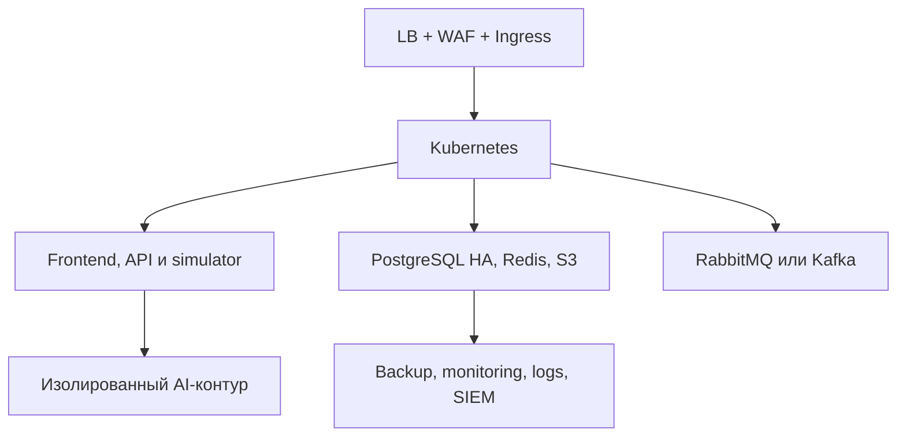

# Индустриализация в частном облаке

Документ отделяет реализованный Docker-прототип от целевого корпоративного решения. Указанные компоненты не считаются внедрёнными, пока не появились код, инфраструктурные манифесты, тесты и эксплуатационная приёмка.

## Целевой образ

Корпоративный онлайн-тренажёр разворачивается внутри защищённого периметра и доступен через браузер по ролевой модели. Решение не подключается к реальной АСУ ТП. ИИ запускается локально, отключается конфигурацией и не участвует в обязательной оценке.

## Целевая платформа

| Область | Прототип | Целевое состояние |
| --- | --- | --- |
| вход | Nginx, HTTP localhost | балансировщик, WAF, Ingress, корпоративный TLS |
| окружения | один Compose-проект | TEST, PREPROD, PROD в отдельных node pool и сетевых политиках |
| идентификация | локальные пользователи и Redis-сессии | AD/корпоративный IdP, OIDC/OAuth2, MFA по политике |
| приложения | Compose, связанный `system-api` | независимо развёртываемые сервисы с контрактами |
| симуляция | Python внутри `system-api` | выделенный simulation engine; тяжёлые расчёты допускают Go/Rust worker |
| события | HTTP/WebSocket | WebSocket для UI и RabbitMQ/Kafka для надёжной доставки |
| БД | один PostgreSQL | PostgreSQL HA в разных зонах, failover, PITR, отдельная БД на среду |
| оперативные данные | один Redis | кластер/managed Redis с политиками TTL и восстановления |
| файлы | Git и volumes | корпоративное S3-хранилище с версионированием |
| ИИ | CPU llama.cpp, Qdrant | изолированные CPU/GPU workers, реестр моделей, eval/red-team gates |
| эксплуатация | health и локальные логи | метрики, трассировка, централизованные логи, SIEM, Vault, backup |

## Среды и доступ

- `TEST`: разработчики, тестировщики и администраторы соответствующих служб;
- `PREPROD`: только разработчики, назначенные тестировщики и администраторы; обязательны интеграционные проверки доступа, миграций, восстановления и совместимости;
- `PROD`: пользователи по рабочим ролям и администраторы по принципу минимальных привилегий.

Администраторы инфраструктуры, платформы, БД, ИБ и приложения получают раздельные роли. Общие административные учётные записи не применяются.

## Шлюз внедрения

Перевод в PROD разрешается после:

1. успешных функциональных, интеграционных, нагрузочных и security-проверок;
2. подписания протокола PREPROD владельцем продукта, методологом, эксплуатацией и ИБ;
3. подтверждения резервной копии и теста восстановления;
4. подготовки плана внедрения, наблюдения и отката;
5. проверки совместимости схемы БД и клиентских контрактов.

После неудачного внедрения выполняется откат, а затем отдельная проверка работоспособности восстановленной версии и целостности данных. Сам факт запуска команды rollback не считается успешным восстановлением.

## Обязательные результаты до production

- OpenAPI и версии событийных контрактов;
- миграции БД с forward/rollback-стратегией;
- SBOM, SCA, подпись образов и проверенный корпоративный registry;
- threat model и результаты тестирования безопасности;
- SLO/SLI, алерты, runbook и матрица эскалаций;
- результаты нагрузочных испытаний ролевых и совместных сессий;
- стратегия backup, PITR и проверенные RTO/RPO;
- реестр моделей, набор eval-тестов и гарантированный AI-off режим;
- подтверждённая доступность интерфейса и поддерживаемая матрица браузеров.
